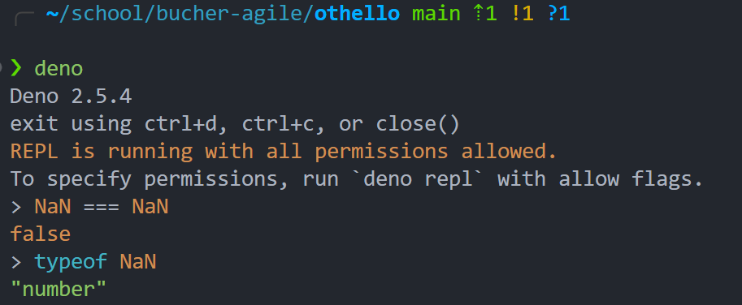

# Othello

## Zusatzfrage: Whitebox-Testverfahren
Verweis: [Whitebox-Testverfahren](https://m450.frickelbude.ch/uebungen/whitebox-testverfahren/index.html#zusatzfrage)
Ausgangslage: Die erste Aufgabe (Fibonacci) verwendet JavaScript, die zweite (quadratische Gleichungen) TypeScript. Deno führt beides ohne Zwischenschritt aus.

Frage: Welchen Einfluss hat die Wahl der Sprache auf Testfallermittlung, -umsetzung und Codeabdeckung?
Antwort:
- Testfallermittlung: Statische Typen in TypeScript machen Grenzfälle (null, undefined, Union-Typen) explizit und erleichtern Ableitung von Pfad- und Branch-Tests.
- Umsetzung: Typfehler werden vor Laufzeit erkannt; Testcode fokussiert auf Logik statt auf Laufzeittypprüfungen.
- Codeabdeckung: Typen erhöhen nicht direkt die Coverage, reduzieren aber unnötige bzw. tote Pfade und verbessern Aussagekraft der Metrik.
- JavaScript erfordert mehr defensive Tests (Typ- und Existenzprüfungen), wodurch zusätzliche Fälle entstehen.

## Warum TypeScript?
TypeScript ist typsicher. Das bedeutet:

- Datentypen können explizit deklariert werden (im Gegensatz zu JavaScript).
- Der Compiler erkennt viele Typfehler bereits vor der Testausführung.
- Frühes Feedback reduziert Laufzeitfehler und vereinfacht Whitebox-Tests.

Kurz gesagt: Statische Typisierung entdeckt Fehler früher und macht Tests fokussierter sowie zuverlässiger.

---
Meinung:
Javascript ist ein Fehler und wurde in nur 2 Tagen entwicklet (was bemerktbar ist). Typescript ist die Korrektur von Javascript. Wenn man die Wahl zwischen TS und JS hat und man JS wählt, ist man selber schuld.

JS in Action example:
